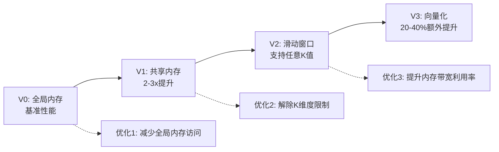
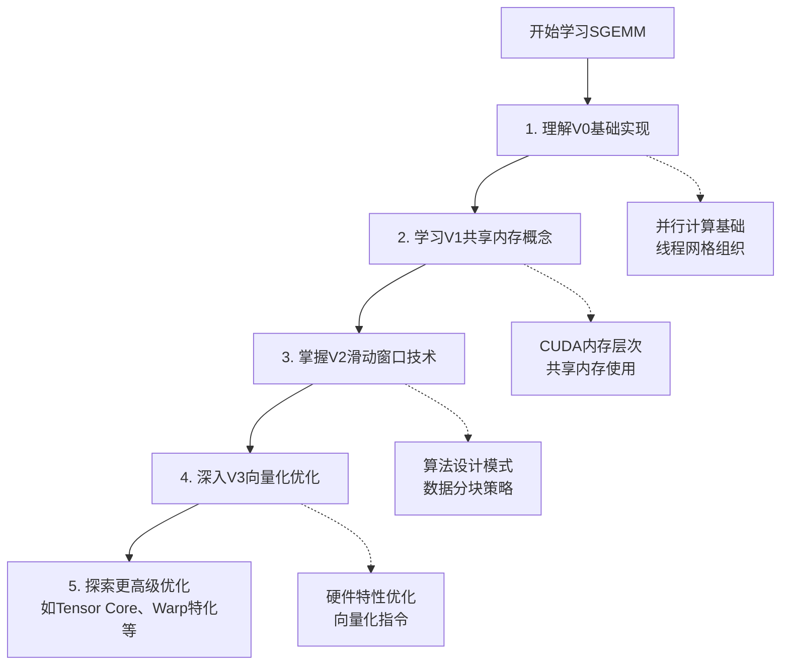

# SGEMM优化版本总览

本目录包含了SGEMM（单精度通用矩阵乘法）的4个优化版本，每个版本都针对不同的性能瓶颈进行了专门的优化。

## 版本概览

| 版本 | 文件名 | 主要优化技术 | 性能特点 | 适用场景 |
|------|--------|-------------|----------|----------|
| V0 | `my_sgemm_v0_global_mem.cu` | 基础实现 | 性能基准 | 学习基础概念 |
| V1 | `my_sgemm_v1_shared_mem.cu` | 共享内存 | 2-3倍提升 | 理解共享内存 |
| V2 | `my_sgemm_v2_shared_mem_sliding_window.cu` | 滑动窗口 | 通用性强 | 任意矩阵大小 |
| V3 | `my_sgemm_v3_using_float4.cu` | 向量化加载 | 内存带宽优化 | 现代GPU架构 |

## 性能演进图



## 技术特点对比

### 内存访问模式

```text
V0: 全局内存直接访问
├── 优点：实现简单，易理解
└── 缺点：大量重复内存访问，延迟高

V1: 共享内存缓存
├── 优点：减少全局内存访问，数据复用
└── 缺点：K维度受限于共享内存大小

V2: 滑动窗口共享内存
├── 优点：支持任意K值，内存使用固定
└── 缺点：增加同步开销

V3: 向量化加载共享内存
├── 优点：最大化内存带宽，指令级优化
└── 缺点：实现复杂，边界处理困难
```

### 算法复杂度对比

| 版本 | 全局内存访问次数 | 共享内存大小 | 同步次数 | 实现复杂度 |
|------|-----------------|-------------|----------|------------|
| V0 | (2K + 1) × M × N | 0 | 0 | 低 |
| V1 | M×K + K×N + M×N | K × BLOCK_SIZE | 1 | 中 |
| V2 | M×K + K×N + M×N | BLOCK_SIZE² | 2×⌈K/BLOCK_SIZE⌉ | 中高 |
| V3 | M×K + K×N + M×N | BLOCK_SIZE² | 2×⌈K/BLOCK_SIZE⌉ | 高 |

## 详细文档链接

- [V0版本详细分析](./sgemm_v0_logic_diagram.md) - 全局内存基础实现
- [V1版本详细分析](./sgemm_v1_logic_diagram.md) - 共享内存优化
- [V2版本详细分析](./sgemm_v2_logic_diagram.md) - 滑动窗口技术
- [V3版本详细分析](./sgemm_v3_logic_diagram.md) - Float4向量化优化

## 学习路径建议



## 性能测试建议

### 编译和运行

```bash
# 进入构建目录
cd build

# 编译所有版本
make

# 运行性能测试
echo "=== V0 全局内存版本 ==="
./my_sgemm_v0_global_mem

echo "=== V1 共享内存版本 ==="
./my_sgemm_v1_shared_mem

echo "=== V2 滑动窗口版本 ==="
./my_sgemm_v2_shared_mem_sliding_window

echo "=== V3 向量化版本 ==="
./my_sgemm_v3_using_float4
```

### 性能分析工具

```bash
# 使用nvprof分析性能
nvprof --metrics gld_efficiency,gst_efficiency ./my_sgemm_v3_using_float4

# 使用nsight进行详细分析
ncu --set full ./my_sgemm_v3_using_float4
```

## 优化技术总结

### 1. 内存层次优化
- **全局内存** → **共享内存**：减少延迟，提高数据复用
- **合并访问**：提升内存带宽利用率
- **向量化加载**：充分利用128位内存总线

### 2. 算法设计优化
- **数据分块**：将大矩阵分解为适合共享内存的小块
- **滑动窗口**：支持任意矩阵大小的通用算法
- **循环展开**：减少控制开销，提高指令级并行性

### 3. 硬件特性利用
- **线程束执行**：避免分支分歧，提高并行效率
- **SIMD指令**：使用float4等向量类型
- **内存对齐**：优化缓存行利用率

## 后续优化方向

1. **Tensor Core利用**：使用混合精度和Tensor Core加速
2. **多级Cache优化**：利用L1/L2缓存的特性
3. **Warp级别优化**：warp shuffle等高级技术
4. **自动调优**：基于硬件特性的参数自动选择
5. **多GPU扩展**：分布式矩阵乘法实现

## 总结

这一系列SGEMM实现展示了CUDA性能优化的逐步演进过程：

- **从算法优化到硬件优化**
- **从基础概念到高级技术**
- **从教学示例到生产质量代码**

每个版本都在前一版本的基础上引入新的优化技术，最终实现了显著的性能提升。这种渐进式的学习方法有助于深入理解GPU计算的本质和优化策略。
